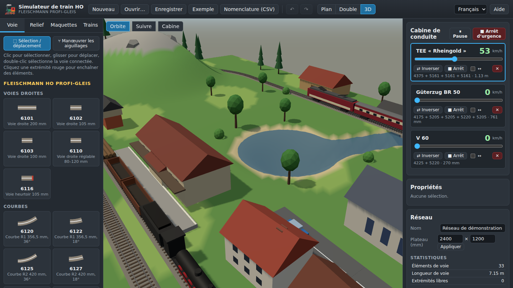

# Simulateur de train HO — Fleischmann Profi-Gleis

*[English version](README.md)*

Une application web pour **concevoir des plans de réseau de train électrique à l'échelle
HO (1:87)** avec le système de voie **Fleischmann Profi-Gleis**, **modeler le relief**,
**placer des maquettes** et **faire circuler des trains Fleischmann** sur le réseau — en
plan 2D et en 3D.

**▶ Version en ligne : <https://gregos-winus.github.io/toytrains/>**



## Fonctionnalités

* **Plan de voie** avec le catalogue Fleischmann HO Profi-Gleis : voies droites, courbes
  R1 à R4, aiguillages 18° (manuels et électriques), aiguillages courbes, aiguillage
  triple, croisements et TJD, avec leurs vraies références et leur géométrie.
  * aimantation sur les extrémités libres, enchaînement rapide des éléments, fermeture
    automatique des boucles ;
  * déplacer / tourner / supprimer, sélection de la voie connectée, annuler / rétablir ;
  * rampes (hauteur à chaque extrémité), piles générées sous les voies surélevées ;
  * statistiques et **nomenclature** exportable en CSV.
* **Relief** : monter, creuser, adoucir et aplanir le terrain, peindre le revêtement,
  lacs et rivières, tunnels, remblais automatiques sous les voies surélevées.
* **Maquettes** : gare, quai, remise, poste d'aiguillage, château d'eau, signaux,
  maisons, église, usine, grange, arbres, rochers, routes, portails de tunnel, voitures…
* **Trains** : locomotives, voitures et wagons Fleischmann, composition de trains et
  trains prêts à rouler, régulateur avec inertie, vitesse à l'échelle en km/h, inversion
  du sens, mode navette, aiguillages talonnés, arrêt aux heurtoirs et avant collision.
* **Vues** : plan 2D (édition) et 3D (three.js) avec caméras orbite, poursuite et cabine ;
  les aiguillages se manœuvrent dans les deux vues.
* Sauvegarde automatique dans le navigateur, import/export `.json`, réseau d'exemple.
* Interface et documentation en **anglais et en français**.

## Documentation

* [Guide d'utilisation (français)](docs/fr/user-guide.md)
* [User guide (English)](docs/en/user-guide.md)

Le guide est aussi disponible dans l'application (bouton **Aide**).

## Lancer en local

L'application est un site statique sans étape de compilation (modules ES, three.js est
inclus dans `vendor/`). N'importe quel serveur web statique convient, par exemple :

```sh
python3 -m http.server 8080
# puis ouvrir http://localhost:8080/
```

Ouvrir `index.html` directement depuis le disque ne fonctionne pas : les navigateurs
bloquent les modules ES chargés depuis `file://`.

### Tests

La géométrie des voies, les raccordements et la simulation des trains sont couverts par
des tests unitaires (Node.js ≥ 18, aucune dépendance à installer) :

```sh
npm test
```

## Publication sur GitHub Pages

Le workflow [`.github/workflows/pages.yml`](.github/workflows/pages.yml) lance les tests à
chaque push et publie le site depuis la branche par défaut.

Réglage à faire une seule fois : dans **Settings → Pages → Build and deployment** du
dépôt, choisir **Source : GitHub Actions**, puis relancer le workflow (ou pousser un
commit). Le site est publié à l'adresse `https://<utilisateur>.github.io/<dépôt>/`.

## Structure du projet

```
index.html            page de l'application
css/app.css           styles
js/
  catalog/tracks.js         géométrie Fleischmann Profi-Gleis
  catalog/rolling-stock.js  locomotives, voitures et wagons Fleischmann
  catalog/scenery.js        maquettes
  geom.js                   géométrie 2D (droites, arcs, transformations)
  model.js                  données du réseau, raccordements, relief, sérialisation
  sim.js                    déplacement des trains sur le graphe de voies
  editor.js                 opérations d'édition
  plan2d.js                 vue plan 2D (canvas)
  view3d.js, models3d.js    vue 3D et modèles procéduraux (three.js)
  panels.js, main.js, app.js, i18n.js   interface utilisateur
docs/                 guides (en, fr) et captures d'écran
tests/                tests unitaires (node:test)
vendor/               three.js et marked (licence MIT)
```

### Format de fichier

Les réseaux sont enregistrés en JSON (`"format": "ho-railway-layout"`) : taille du
plateau, éléments de voie (`ref`, position `x`/`y` en mm, rotation `rot` en radians,
direction `state`, hauteurs `h` aux extrémités), maquettes, trains et carte des hauteurs
du relief (base64).

## Notes et sources

* La géométrie des voies provient des descriptions des produits Fleischmann : 6101 =
  200 mm, 6120 = R1 356,5 mm / 36°, 6125 = R2 420 mm / 36°, 6131 = R3 483,5 mm / 18°,
  6133 = R4 547 mm / 18°, aiguillages 6170–6173 = 200 mm, 18°, déviation R 647 mm
  (= 6138), croisements 6160 (36°, 105 mm) et 6162/6163 (18°, 200/210 mm), TJD 6164–6167.
* Les aiguillages courbes 6174/6175 utilisent une géométrie approchée (intérieur R1 36°,
  extérieur R2 36°).
* Les longueurs du matériel roulant sont approximatives et les modèles 3D simplifiés ;
  les maquettes sont génériques.
* Fleischmann et Profi-Gleis sont des marques de leurs propriétaires respectifs. Ce
  projet est indépendant et non commercial, sans lien avec Fleischmann.
* Bibliothèques tierces : [three.js](https://threejs.org/) et
  [marked](https://marked.js.org/), toutes deux sous licence MIT (voir `vendor/`).
