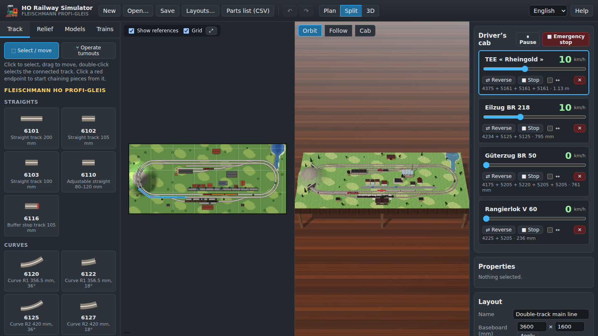
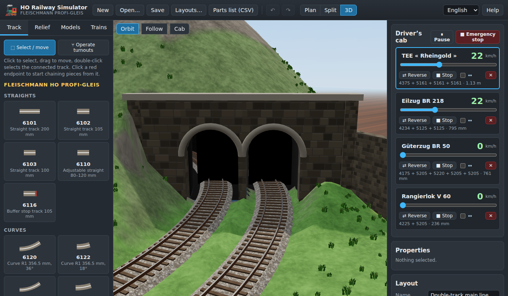

# HO Railway Simulator — Fleischmann Profi-Gleis

*[Version française](README.fr.md)*

A web application to **design HO scale (1:87) model railway layouts** with the
**Fleischmann Profi-Gleis** track system, **sculpt the relief**, **place scenery models**
and **run Fleischmann trains** on the layout — in a 2D plan and in 3D.

**▶ Live version: <https://gregos-winus.github.io/toytrains/>**



## Features

* **Track planning** with the Fleischmann HO Profi-Gleis catalogue: straights, R1–R4 curves,
  18° turnouts (manual and electric), curved turnouts, three-way turnout, crossings and
  double slips, with their real references and geometry.
  * snapping to open ends, fast chaining of pieces, automatic loop closing;
  * move / rotate / delete, selection of connected track, undo / redo;
  * gradients (height at each end of every piece), piers generated under raised track;
  * statistics and **parts list** (bill of materials) exportable as CSV.
* **Relief**: raise, lower, smooth and flatten the terrain, paint the ground cover,
  lakes and rivers, automatic embankments under raised track.
* **Tunnels and bridges built automatically** in 3D: cuttings, open tunnel mouths with
  stone portals (double portals for double track) and vaulted tubes, plate-girder
  bridges on stone piers.
* **Scenery models**: station, platform, engine shed, signal box, water tower, signals,
  houses, town houses with shops, church, factory, barn, trees, rocks, roads, lamps,
  fences, people, tunnel portals, cars… with textured walls and tiled roofs.
* **Detailed rolling stock**: liveries with windows and lettering, bogies, turning
  spoked wheels, steam-locomotive rods, smoke, head lamps.
* **Procedural textures** (grass, gravel ballast, wooden sleepers, brick, stone, roof
  tiles, parquet…) generated in the browser — no image to download.
* **Trains**: Fleischmann locomotives, coaches and wagons, consist builder and
  ready-made trains, throttle with inertia, scale speed in km/h, reversing, shuttle mode,
  turnouts forced when trailed, stop at buffers and before collisions.
* **Views**: 2D plan (editing) and 3D (three.js) with orbit, follow and cab cameras;
  turnouts can be switched in both views.
* **Five example layouts**, from a starter oval to a double-track main line with
  station and yard and a two-level mountain line.
* Automatic saving in the browser, `.json` import/export.
* User interface and documentation in **English and French**.



## Documentation

* [User guide (English)](docs/en/user-guide.md)
* [Guide d'utilisation (français)](docs/fr/user-guide.md)

The guide is also available in the application (**Help** button).

## Running locally

The application is a static site with no build step (ES modules, three.js is vendored).
Any static web server works, for example:

```sh
python3 -m http.server 8080
# then open http://localhost:8080/
```

Opening `index.html` directly from the file system does not work, because browsers block
ES modules loaded from `file://`.

### Tests

The track geometry, connections and train simulation are covered by unit tests
(Node.js ≥ 18, no dependency to install):

```sh
npm test
```

## Publishing on GitHub Pages

The workflow [`.github/workflows/pages.yml`](.github/workflows/pages.yml) runs the tests on
every push and publishes the site from the default branch.

One-time setup: in the repository **Settings → Pages → Build and deployment**, choose
**Source: GitHub Actions**. Then re-run the workflow (or push a commit). The site is
published at `https://<user>.github.io/<repository>/`.

## Project structure

```
index.html            application page
css/app.css           styles
js/
  catalog/tracks.js         Fleischmann Profi-Gleis geometry
  catalog/rolling-stock.js  Fleischmann locomotives, coaches and wagons
  catalog/scenery.js        scenery models
  geom.js                   2D geometry (lines, arcs, transforms)
  model.js                  layout data, connections, terrain, (de)serialisation
  sim.js                    train movement on the track graph
  editor.js                 editing operations
  plan2d.js                 2D plan view (canvas)
  view3d.js, models3d.js    3D view and procedural models (three.js)
  carve.js                  terrain carving for cuttings and tunnel mouths
  textures.js               procedural canvas textures
  layouts/                  example layouts and the builder used to draw them
  panels.js, main.js, app.js, i18n.js   user interface
docs/                 user guides (en, fr) and screenshots
tests/                unit tests (node:test)
vendor/               three.js and marked (MIT licence)
```

### Layout file format

Layouts are saved as JSON (`"format": "ho-railway-layout"`): baseboard size, track pieces
(`ref`, position `x`/`y` in mm, rotation `rot` in radians, route `state`, heights `h` at
each end), scenery, trains and the terrain height map (base64).

## Notes and sources

* Track geometry comes from Fleischmann product descriptions: 6101 = 200 mm, 6120 = R1
  356.5 mm / 36°, 6125 = R2 420 mm / 36°, 6131 = R3 483.5 mm / 18°, 6133 = R4 547 mm / 18°,
  turnouts 6170–6173 = 200 mm, 18°, branch R 647 mm (= 6138), crossings 6160 (36°, 105 mm)
  and 6162/6163 (18°, 200/210 mm), double slips 6164–6167.
* The curved turnouts 6174/6175 use an approximate geometry (inner R1 36°, outer R2 36°).
* Rolling stock lengths are approximate and the 3D models are simplified; the scenery
  models are generic.
* Fleischmann and Profi-Gleis are trademarks of their respective owners. This is an
  independent, non-commercial project, not affiliated with Fleischmann.
* Third-party libraries: [three.js](https://threejs.org/) and
  [marked](https://marked.js.org/), both under the MIT licence (see `vendor/`).
